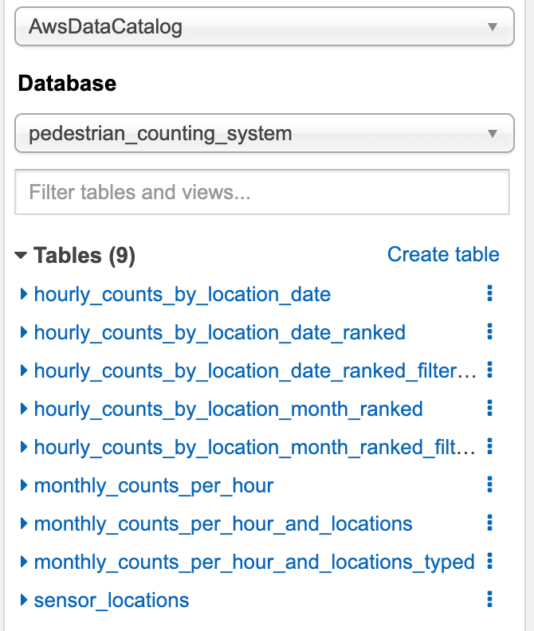

##Belong Code Challenge
### High-Level Desgin


### Data PipeFramework
This is a minimalistic framework that uses yml/sql to drive simple data pipelines 

### Deployment
####prerequisites
create two s3 buckets on AWS named the bucket name as the following:
1.belong-code-challenge-ll-config (store project artifacts)
2.belong-code-challenge-ll-data (store transformed data here)

Ideally, the s3 buckets should be deploy via Terrafrom. 
The data bucket should have a certain level of isolation, can be a structure such as landing, transformed, curated. 

#### Artifacts setup
The artifact is setup in the **setup.py** file. The commands for building the artifacts are in **build_and_deploy.sh**.
Run the following command to build the artifacts, the output will be in wheels format.
```shell
./build_and_deploy.sh 
```

#### Deploy artifacts using terraform
The terraform is used to deploy the artifacts and glue infra to AWS
The module is under **terraform/modules/infra**
The implementation of the modules is under **terraform/datagen/dev/infra**
if you also want to deploy the infra to another environment, for example for prod, you can have another implementation called **terraform/datagen/prod/infra**

deployment steps
1.Go to terminal navigate to the following path
```shell
cd terraform/datagen/dev/infra
```
Run the terraform command to deploy
```terraform
terraform plan
terraform apply
```
To destroy the infrastructure
```terraform
terraform destroy
```
If you work as a team, you will have to setup the terraform backend and store the terrafrom state file in s3 and lock file in dynamoDB.
more details check [here](https://www.terraform.io/docs/language/settings/backends/index.html).

### Glue jobs

There are two glue jobs, one is "dev_belong_code_challenge_upload_to_s3" which sends a request to an API and then uploads the file to s3.
another one is "dev_belong_code_challenge_stats" which transforms the data and help to answer the stat questions.

### Athena

A pedestrian_counting_system database will be created. There will be 9 tables in total under this database

The raw data stores under the table below, which is the output from the glue job dev_belong_code_challenge_upload_to_s3
- monthly_counts_per_hour
- sensor_locations

The transformed tables are below:
- hourly_counts_by_location_date
- hourly_counts_by_loation_date_ranked
- hourly_counts_by_location_month_ranked
- monthly_counts_per_hour_and_locations
- monthly_counts_per_hour_and_locations_typed

#### The statistics result are in the following tables
belong-code-challenge-athena.png
**Top 10 (most pedestrians) locations by day:**
- hourly_counts_by_location_date_ranked_filtered

**Top 10 (most pedestrians) locations by month:**
- hourly_counts_by_location_month_ranked_filtered


